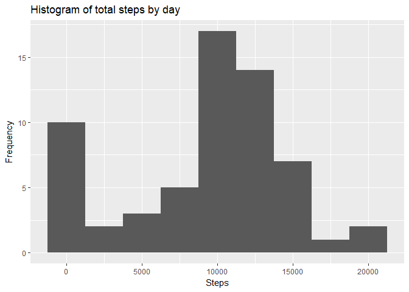
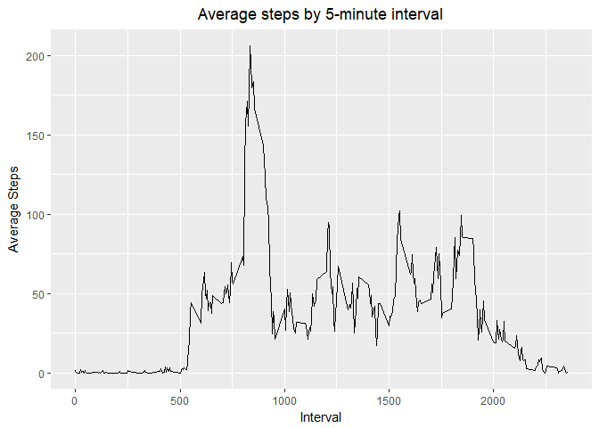
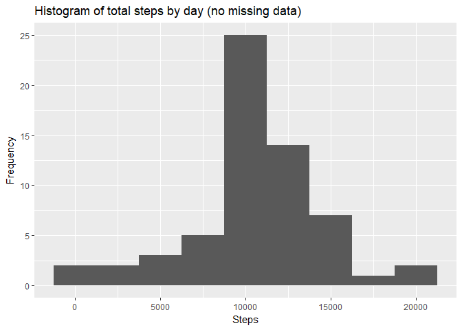
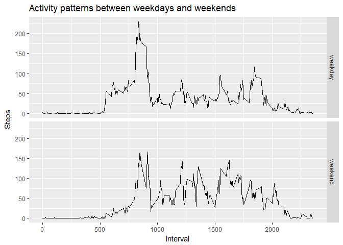

=======================================================================================

This assignment makes use of data from a personal activity monitoring device. This device collects data at 5 minute intervals through out the day. The data consists of two months of data from an anonymous individual collected during the months of October and November, 2012 and include the number of steps taken in 5 minute intervals each day.

## Loading and preprocessing the data
  1. Load the data (i.e. read.csv())

```r
if(!file.exists('activity.csv')){
    unzip('activity.zip')
}
activityData <- read.csv('activity.csv')
```
  
  2. Process/transform the data into a format suitable for analysis

```r
#Change to date format
activityData$date <- as.Date(activityData$date)
```
  
## What is mean total number of steps taken per day?

  1. Calculate the total number of steps taken per day and list first 6 lines

```r
stepsDay <- aggregate(activityData$steps, by=list(activityData$date), FUN=sum, na.rm=TRUE)
names(stepsDay) <- c("Day","Steps")
head(stepsDay)
```

```
##          Day Steps
## 1 2012-10-01     0
## 2 2012-10-02   126
## 3 2012-10-03 11352
## 4 2012-10-04 12116
## 5 2012-10-05 13294
## 6 2012-10-06 15420
```

  2. Make a histogram of the total number of steps taken each day

```r
library(ggplot2)
qplot(stepsDay$Steps, geom="histogram",  binwidth = 2500, main="Histogram of total steps by day", xlab="Steps",ylab="Frequency")  
```

<!-- -->

  3. Calculate and report the mean and median of the total number of steps taken per day

```r
meanStepsDay <- mean(stepsDay$Steps)
medianStepsDay <- median(stepsDay$Steps)
```

The mean is **9354** and the median is **10395**

  
## What is the average daily activity pattern?

  1. Make a time series plot (i.e. type="l") of the 5-minute interval (x-axis) and the average number of steps taken, averaged across all days (y-axis)

```r
averageStepsTime <- aggregate(activityData$steps, by=list(activityData$interval), FUN=mean, na.rm=TRUE)
names(averageStepsTime) <- c("interval","meanSteps")
ggplot(data=averageStepsTime, aes(x=interval, y = meanSteps)) + 
  geom_line() + 
  xlab("Interval") +
  ylab("Average Steps") +
  ggtitle("Average steps by 5-minute interval")+
  theme(plot.title = element_text(hjust = 0.5))
```

<!-- -->

  2. Which 5-minute interval, on average across all the days in the dataset, contains the maximum number of steps?

```r
max <- averageStepsTime$interval[which.max(averageStepsTime$meanSteps)]
```
The 5-minute interval is **835** and it´s equal to **206**

## Imputing missing values
  1. Calculate and report the total number of missing values in the dataset (i.e. the total number of rows with NAs)

```r
count_NA <- sum(is.na(activityData$steps))
```
The total NA is **2304** and correspond to **13**%

  2. Devise a strategy for filling in all of the missing values in the dataset.
We filled the missing values with the mean of each 5-minutes interval. This function will return a respective mean of interval, calculated before and stored in "averageStepsTime".

```r
getAverageStepByInterval <- function(i){averageStepsTime[averageStepsTime$interval==i,]$meanSteps}
```

  3. Create a new dataset that is equal to the original dataset but with the missing data filled in.

```r
#clone dataset
newActivityData <- activityData

#get all index where missing data
indexNA <- which(is.na(newActivityData$steps))

#for each missing data, get respective mean of the 5-minute interval
for(i in 1:length(indexNA)){
  newActivityData[indexNA[i],]$steps <- getAverageStepByInterval(newActivityData[indexNA[i],]$interval)
}

#list first elements
head(newActivityData)
```

```
##       steps       date interval
## 1 1.7169811 2012-10-01        0
## 2 0.3396226 2012-10-01        5
## 3 0.1320755 2012-10-01       10
## 4 0.1509434 2012-10-01       15
## 5 0.0754717 2012-10-01       20
## 6 2.0943396 2012-10-01       25
```

  4. Make a histogram of the total number of steps taken each day and Calculate and report the mean and median total number of steps taken per day. Do these values differ from the estimates from the first part of the assignment? What is the impact of imputing missing data on the estimates of the total daily number of steps?

```r
stepsDayNoMissing <- aggregate(newActivityData$steps, by=list(newActivityData$date), FUN=sum)
names(stepsDayNoMissing) <- c("Day","Steps")
qplot(stepsDayNoMissing$Steps, geom="histogram",  binwidth = 2500, main="Histogram of total steps by day (no missing data)", xlab="Steps",ylab="Frequency")
```

<!-- -->

```r
meanNoMissing <- mean(stepsDayNoMissing$Steps)
medianNoMissing <- median(stepsDayNoMissing$Steps)
```
The new mean is **10766** and increase about **15**% of original values  
The new median is **10766** and increase about **3**% of original values

## Are there differences in activity patterns between weekdays and weekends?
  1. Create a new factor variable in the dataset with two levels - "weekday" and "weekend" indicating whether a given date is a weekday or weekend day

```r
#set default locale
Sys.setlocale("LC_TIME", "English")
```

```
## [1] "English_United States.1252"
```

```r
newActivityData$day <- weekdays(newActivityData$date)
newActivityData$day=ifelse( (newActivityData$day == "Saturday" | 
                                     newActivityData$day == "Sunday"), "weekend", 
                                     "weekday")
head(newActivityData)
```

```
##       steps       date interval     day
## 1 1.7169811 2012-10-01        0 weekday
## 2 0.3396226 2012-10-01        5 weekday
## 3 0.1320755 2012-10-01       10 weekday
## 4 0.1509434 2012-10-01       15 weekday
## 5 0.0754717 2012-10-01       20 weekday
## 6 2.0943396 2012-10-01       25 weekday
```
  
  2. Make a panel plot containing a time series plot (i.e. type="l") of the 5-minute interval (x-axis) and the average number of steps taken, averaged across all weekday days or weekend days (y-axis)

```r
stepsDayType <- aggregate(newActivityData$steps, by=list(newActivityData$interval,newActivityData$day), FUN=mean)
names(stepsDayType) <- c("Interval","Day","Steps")

ggplot(data=stepsDayType, aes(x=Interval, y = Steps)) + 
  geom_line() + 
  xlab("Interval") +
  ylab("Steps") +
  ggtitle("Activity patterns between weekdays and weekends")+
   facet_grid(Day ~ .)
```

<!-- -->

